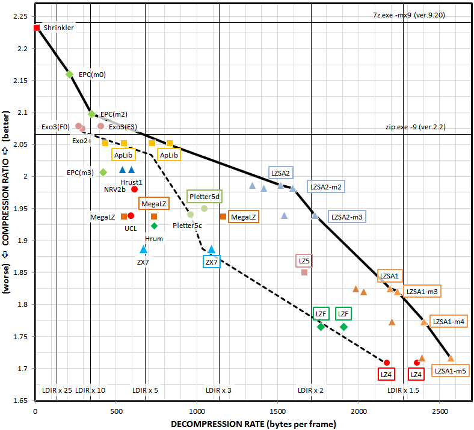

LZSA is a collection of byte-aligned compression formats that are specifically engineered for very fast decompression on 8-bit systems. It can compress files of any size by using blocks of a maximum size of 64 Kb with block-interdependent compression and up to 64 Kb of back-references for matches.

*ZX Spectrum

Check out [The Hollow](https://www.pouet.net/prod.php?which=81909) by Darklite and Offense, winner of the Solskogen 2019 wild compo, that uses LZSA on Z80.

[Gabba](https://www.pouet.net/prod.php?which=83539) by Stardust ranked 2nd in the ZX Spectrum demo compo at CAFe demoparty 2019 and also used LZSA on Z80. 

[Myst Demake](http://www.deater.net/weave/vmwprod/mist/) for the Apple II by Vince Weaver, uses LZSA on 6502.

The 8 bit guy's [Commander X16 ROM](https://github.com/commanderx16/x16-rom) uses LZSA on 6502 as well.

[RomWBW](https://github.com/wwarthen/RomWBW) uses LZSA on Z80 for a variety of hobbyist computers.

The popular [rasm](https://github.com/EdouardBERGE/rasm) assembler for Z80 features LZSA-compressed data sections.

The [desolate](https://github.com/nzeemin/spectrum-desolate) game port to the ZX Spectrum uses LZSA compression on Z80.

The LZSA compression tool uses an aggressive optimal packing strategy to try to find the sequence of commands that gives the smallest packed file that decompresses to the original while maintaining the maximum possible decompression speed.

The compression formats give the user choices that range from decompressing faster than LZ4 on 8-bit systems with better compression, to compressing as well as ZX7 with much better decompression speed. LZSA1 is designed to replace LZ4 and LZSA2 to replace ZX7, in 8-bit scenarios.

Compression ratio comparison between LZSA and other optimal packers, for a workload composed of ZX Spectrum and C64 files:

                         Bytes            Ratio            Decompression speed vs. LZ4
    LZSA2                676681           52,49% <------   75%   
    MegaLZ 4.89          679041           52,68%           Not measured
    ZX7                  687133           53,30%           47,73%
    LZ5 1.4.1            727107           56,40%           75%
    LZSA1                735785           57,08% <------   90%
    Lizard -29           776122           60,21%           Not measured
    LZ4_HC -19 -B4 -BD   781049           60,59%           100%
    Uncompressed         1289127          100%             N/A

Performance over well-known compression corpus files:

                         Uncompressed     LZ4_HC -19 -B4 -BD    LZSA1                LZSA2
    Canterbury           2810784          935827 (33,29%)       850792 (30,27%)      770877 (27,43%)
    Silesia              211938580        77299725 (36,47%)     73706340 (34,78%)    68928564 (32,52%)
    Calgary              3251493          1248780 (38,40%)      1192123 (36,67%)     1110290 (34,15%)
    Large                11159482         3771025 (33,79%)      3648393 (32,69%)     3519480 (31,54%)
    enwik9               1000000000       371841591 (37,18%)    355360043 (35,54%)   334900611 (33,49%)

As an example of LZSA1's simplicity, a size-optimized decompressor on Z80 has been implemented in 67 bytes.

The compressor is approximately 2X slower than LZ4_HC but compresses better while maintaining similar decompression speeds and decompressor simplicity.

The main differences between LZSA1 and the LZ4 compression format are:

* The use of short (8-bit) match offsets where possible. The match-finder and optimizer cooperate to try and use the shortest match offsets possible.
* Shorter encoding of lengths. As blocks are maximum 64 Kb in size, lengths can only be up to 64 Kb.
* As a result of the smaller commands due to the possibly shorter match offsets, a minimum match size of 3 bytes instead of 4. The use of small matches is driven by the optimizer, and used where they provide gains.

As for LZSA2:
* 5-bit, 9-bit, 13-bit and 16-bit match offsets, using nibble encoding
* Rep-matches
* Shorter encoding of lengths, also using nibbles
* A minmatch of 2 bytes
* No (slow) bit-packing. LZSA2 uses byte alignment in the hot path, and nibbles.

Inspirations:

* [LZ4](https://github.com/lz4/lz4) by Yann Collet.
* [LZ5/Lizard](https://github.com/inikep/lizard) by Przemyslaw Skibinski and Yann Collet.
* The suffix array intervals in [Wimlib](https://wimlib.net/git/?p=wimlib;a=tree) by Eric Biggers.
* ZX7 by Einar Saukas
* [apc](https://github.com/svendahl/cap) by Sven-Åke Dahl
* [Charles Bloom](http://cbloomrants.blogspot.com/)'s compression blog

License:

* The LZSA code is available under the Zlib license.
* The match finder (matchfinder.c) is available under the CC0 license due to using portions of code from Eric Bigger's Wimlib in the suffix array-based matchfinder.

8-bit assembly code:

* Z80 decompressors (size- and speed-optimized) written by [introspec](https://github.com/specke) with optimizations by [uniabis](https://github.com/uniabis)
* 6502 and 8088 size-optimized improvements by [Peter Ferrie](https://github.com/peterferrie)
* 6502 speed-optimized decompressor by [John Brandwood](https://github.com/jbrandwood)
* 8088 speed-optimized decompressor by [Jim Leonard](https://github.com/mobygamer)
* 6809 decompressors (Tandy CoCo, Thomson MO/TO, Dragon 32/64..) optimized by [Doug Masten](https://github.com/dougmasten)
* Hitachi 6309 decompressors (Tandy CoCo 3) also contributed by [Doug Masten](https://github.com/dougmasten)

External links:

* [i8080 decompressors](https://gitlab.com/ivagor/lzsa8080/tree/master) by Ivan Gorodetsky
* [PDP-11 decompressors](https://gitlab.com/ivagor/lzsa8080/tree/master/PDP11) also by Ivan Gorodetsky
* [MC68000 decompressors](https://github.com/tattlemuss/lz4-m68k/blob/master/src/lzsa.s) by Steven Tattersall
* [Gameboy decompressors](https://github.com/meltycode) by Meltycode, based on the Z80 code by introspec
* LZSA's page on [Pouet](https://www.pouet.net/prod.php?which=81573)

# Compressed format

Decompression code is provided for common 8-bit CPUs such as Z80 and 6502. However, if you would like to write your own, or understand the encoding, LZSA compresses data to a format that is fast and simple to decompress on 8-bit CPUs. It is encoded in either a stream of blocks, or as a single raw block, depending on command-line settings. The encoding is deliberately designed to avoid complicated operations on 8-bits (such as 16-bit math).

* [Stream format](https://github.com/emmanuel-marty/lzsa/blob/master/StreamFormat.md)
* [Block encoding for LZSA1](https://github.com/emmanuel-marty/lzsa/blob/master/BlockFormat_LZSA1.md)
* [Block encoding for LZSA2](https://github.com/emmanuel-marty/lzsa/blob/master/BlockFormat_LZSA2.md)
